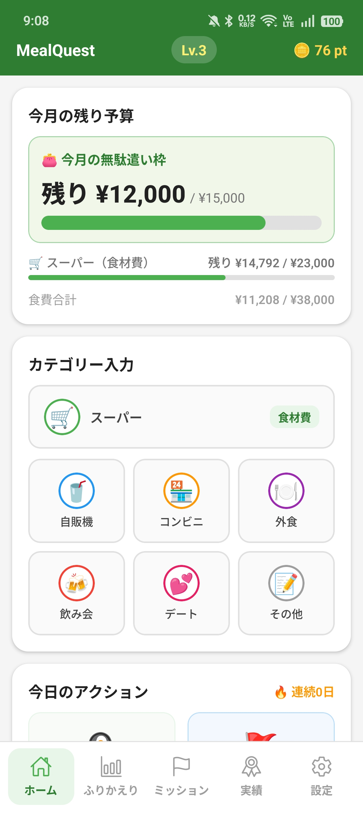
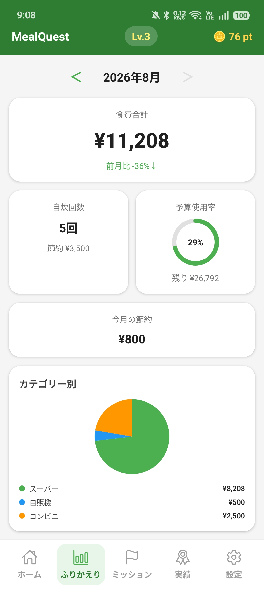
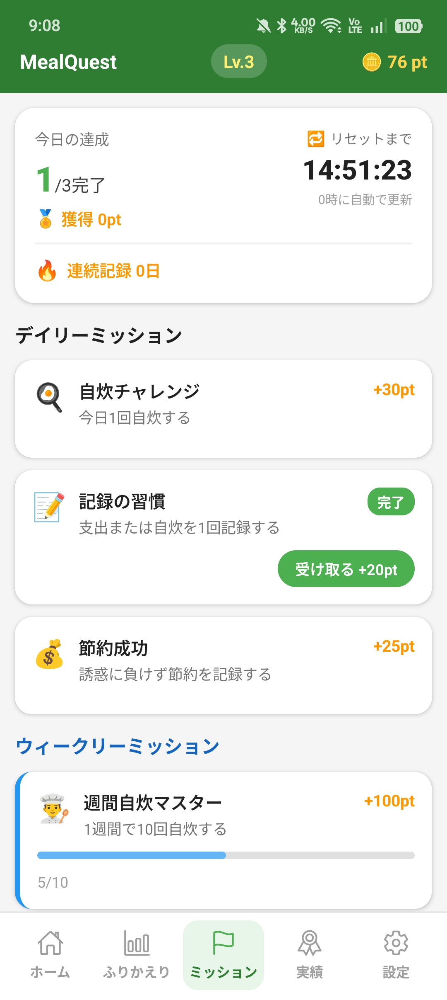
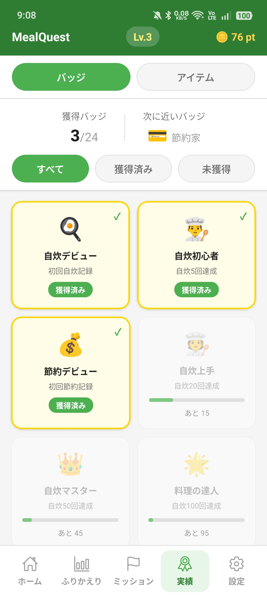
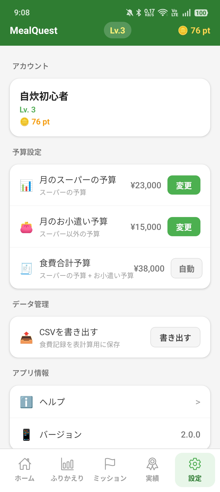

# MealQuest

食費の記録と予算管理にゲーム要素を組み合わせ、節約と自炊を楽しく続けるためのAndroidアプリです。

[Google Playで見る](https://play.google.com/store/apps/details?id=com.mealquest.app)

## アプリについて

スーパー、コンビニ、外食などの食費を記録し、月の予算と支出状況を確認できます。自炊の記録でポイントを獲得し、ミッション、レベル、バッジ、コレクションを進めながら、日々の食生活と支出を振り返れます。

## 主な機能

- スーパー、コンビニ、外食など7カテゴリーの食費記録
- 朝食・昼食・夕食・間食ごとの記録
- スーパー予算と、それ以外のお小遣い予算の管理
- 月別・週別・カテゴリー別の支出確認
- 自炊記録によるポイント獲得
- デイリー・ウィークリーミッション
- レベル、24種類のバッジ、ガチャコレクション
- 食費記録のCSV出力
- 端末内へのデータ保存

## 画面

<p>
  
  
  
  
  
</p>

## 設計で重視したこと

### 記録を継続できる仕組み

支出額を確認するだけで終わらず、自炊、ミッション、ポイント、バッジ、コレクションを一つの循環として設計しています。

### 実際の使い分けに合わせた予算管理

自炊用の食材を購入する「スーパー」と、コンビニや外食などに使う「お小遣い」を分けて管理できます。

### 端末内で完結するデータ保存

記録はAsyncStorageを使って端末内に保存します。保存形式の変更時には、既存データを引き継ぐための移行処理を実装しています。

## 使用技術

- TypeScript
- React Native
- Expo / Expo Router
- Zustand
- AsyncStorage
- react-native-svg

## 現在のアプリ

現在公開しているモバイルアプリは `mobile/` 配下です。ルート直下のWeb版は過去の実装として残しており、現在の開発対象ではありません。

## 開発環境

```bash
cd mobile
npm install
npm run start
```

型とコード品質の確認は次のコマンドで実行します。

```bash
npm run typecheck
npm run lint
```

## AIの活用について

企画、課題設定、要件整理、判断、動作確認は本人が行い、実装や技術調査の一部で生成AIを活用しています。
